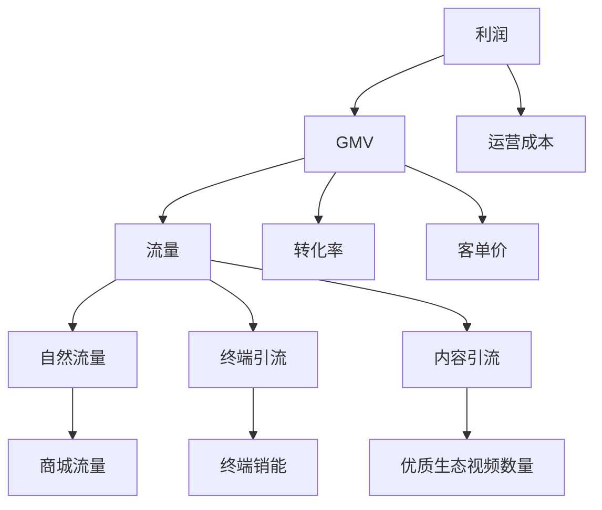
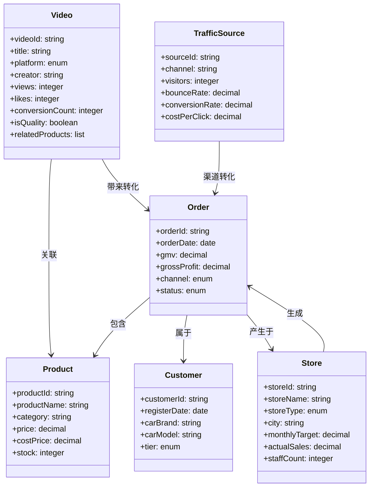
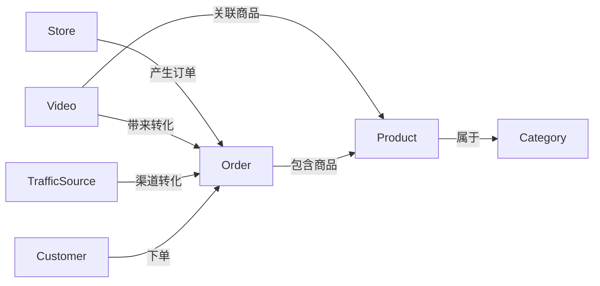
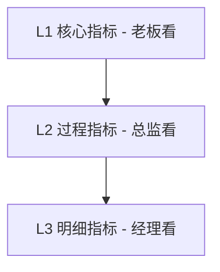
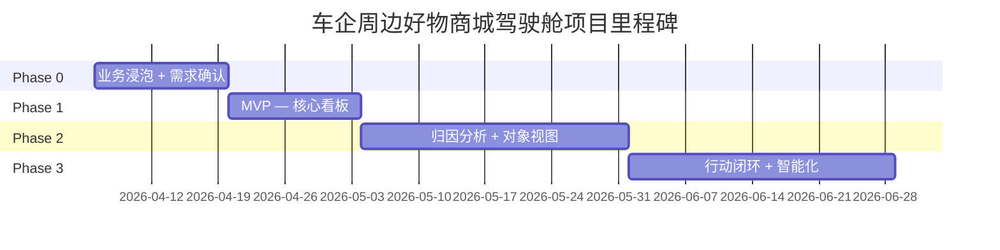
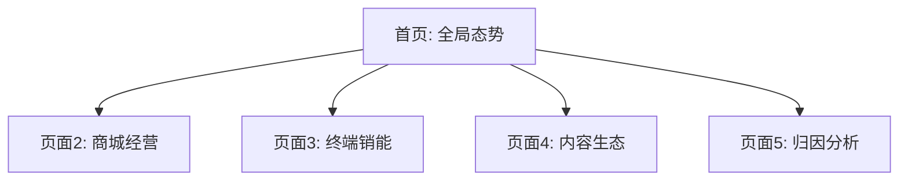
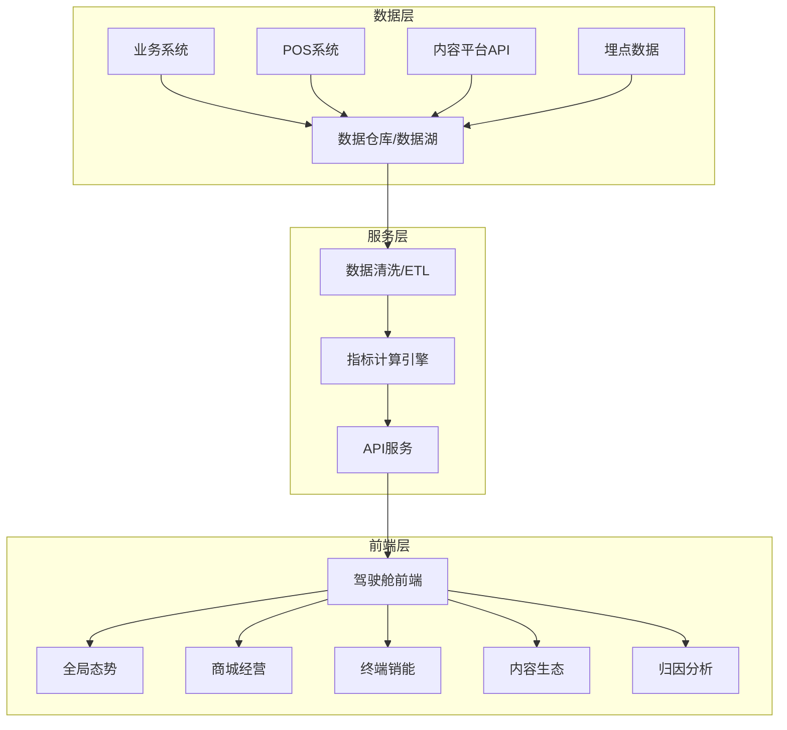

# 车企周边好物商城驾驶舱 — 项目整体规划

> 版本：v1.0 | 更新日期：2026-04-02 | 状态：规划中

---

## 目录

1. [业务模型分析](#1-业务模型分析)
2. [本体论建模方案（更新版）](#2-本体论建模方案更新版)
3. [指标体系设计](#3-指标体系设计)
4. [项目分阶段规划](#4-项目分阶段规划)
5. [每周工作计划模板](#5-每周工作计划模板)
6. [驾驶舱页面规划](#6-驾驶舱页面规划)
7. [技术架构建议](#7-技术架构建议)

---

## 1. 业务模型分析

### 1.1 背景

本项目基于**车企周边好物商城**业务，月报中包含 6 大核心指标：

| 指标 | 说明 |
|------|------|
| **GMV**（成交总额） | 商城整体成交规模 |
| **毛利** | GMV 扣除商品成本后的利润 |
| **利润** | 毛利扣除运营成本后的净利润 |
| **终端销能** | 线下 4S 店/门店渠道的综合销售能力 |
| **优质生态视频数量** | 平台上达到质量标准的内容视频数量 |
| **商城流量** | 线上商城的访问人次 |

### 1.2 业务模型：三位一体

这 6 个指标揭示了业务的独特结构——不是纯线上电商，而是**线上商城 + 线下终端 + 内容生态**三位一体的商业模式。

```
┌─────────────────────────────────────────────────────────────────┐
│                        三位一体商业模式                          │
│                                                                  │
│   线上商城                  线下终端                 内容生态    │
│  （商城流量）               （终端销能）           （生态视频）  │
│       │                        │                       │        │
│  流量→转化→GMV          4S店/门店→订单           视频→种草→引流  │
│       │                        │                       │        │
│       └────────────────────────┴───────────────────────┘        │
│                                │                                 │
│                       GMV → 毛利 → 利润                         │
└─────────────────────────────────────────────────────────────────┘
```

### 1.3 指标结构解析

```
经营三层漏斗
┌──────────────────────┐
│   GMV（规模）         │  ← 线上商城 + 线下终端综合成交
├──────────────────────┤
│   毛利（效率）        │  ← GMV × 毛利率
├──────────────────────┤
│   利润（盈利）        │  ← 毛利 - 运营成本
└──────────────────────┘

三大引擎
┌──────────────────────┐   ┌──────────────────────┐   ┌──────────────────────┐
│   线上商城            │   │   线下终端            │   │   内容生态            │
│  商城流量             │   │  终端销能             │   │  优质生态视频数量     │
│  （获客能力）         │   │  （渠道能力）         │   │  （内容营销能力）     │
└──────────────────────┘   └──────────────────────┘   └──────────────────────┘
```

### 1.4 利润公式拆解

```
利润 = GMV × 毛利率 - 运营成本

GMV = 流量 × 转化率 × 客单价

流量 = 自然流量 + 终端引流 + 内容引流
         ↑            ↑            ↑
      SEO/直推      4S店扫码     视频种草
```



---

## 2. 本体论建模方案（更新版）

基于 Palantir Foundry 本体论（Ontology）设计思路，结合实际业务指标进行建模。

### 2.1 对象类型（Object Types）

#### 核心对象



#### 新增对象类型说明

**Store（终端门店）**

| 属性 | 类型 | 说明 |
|------|------|------|
| storeId | string | 门店唯一标识 |
| storeName | string | 门店名称 |
| storeType | enum | 类型：4S店 / 城市展厅 / 快闪店 |
| city | string | 所在城市 |
| monthlyTarget | decimal | 月度目标销售额 |
| actualSales | decimal | 实际销售额 |
| staffCount | integer | 销售人员数量 |

**Video（生态视频）**

| 属性 | 类型 | 说明 |
|------|------|------|
| videoId | string | 视频唯一标识 |
| title | string | 视频标题 |
| platform | enum | 平台：抖音 / 小红书 / B站 / 视频号 |
| creator | string | 创作者/KOL |
| views | integer | 播放量 |
| likes | integer | 点赞数 |
| conversionCount | integer | 带来的转化订单数 |
| isQuality | boolean | 是否为优质视频 |
| relatedProducts | list | 关联商品列表 |

**TrafficSource（流量来源）**

| 属性 | 类型 | 说明 |
|------|------|------|
| sourceId | string | 来源唯一标识 |
| channel | string | 渠道名称 |
| visitors | integer | 访客数 |
| bounceRate | decimal | 跳出率 |
| conversionRate | decimal | 转化率 |
| costPerClick | decimal | 点击成本 |

### 2.2 关系链（Relations）



| 关系 | 主体 | 客体 | 说明 |
|------|------|------|------|
| Store → Order | 终端门店 | 订单 | 门店产生的线下订单 |
| Video → Product | 生态视频 | 商品 | 视频关联推荐的商品 |
| Video → Order | 生态视频 | 订单 | 视频种草带来的转化订单 |
| TrafficSource → Order | 流量来源 | 订单 | 各流量渠道的转化订单 |

---

## 3. 指标体系设计

围绕 6 大核心指标，设计**三层指标体系**：

### 3.1 指标层级总览



### 3.2 L1 核心指标（老板看的）

| 指标名称 | 英文名 | 定义 | 更新频率 |
|---------|--------|------|---------|
| GMV | Gross Merchandise Volume | 成交总额（含退款前） | 日更 |
| 毛利 | Gross Profit | GMV × 毛利率 | 日更 |
| 利润 | Net Profit | 毛利 - 运营成本 | 月更 |
| 终端销能 | Terminal Sales Capability | 门店综合销售能力得分 | 周更 |
| 优质视频数 | Quality Video Count | 达标优质视频数量 | 周更 |
| 商城流量 | Mall Traffic | UV（独立访客数） | 日更 |

### 3.3 L2 过程指标（总监看的）

| 指标名称 | 定义 | 计算公式 | 归因维度 |
|---------|------|---------|---------|
| 转化率 | 下单用户 / 总访客 | 订单数 / UV | 渠道、品类、时段 |
| 客单价 | 平均每单金额 | GMV / 订单数 | 品类、渠道、用户层级 |
| 复购率 | 二次及以上购买用户占比 | 复购用户数 / 总购买用户数 | 品类、时间段 |
| 门店达标率 | 完成月度目标的门店占比 | 达标门店数 / 总门店数 | 城市、门店类型 |
| 视频完播率 | 完整看完视频的用户占比 | 完播用户 / 播放用户 | 平台、创作者、品类 |
| 跳出率 | 只浏览一页就离开的用户占比 | 单页访问数 / 总访问数 | 渠道、页面、设备 |

### 3.4 L3 明细指标（经理看的）

| 指标名称 | 定义 | 数据来源 |
|---------|------|---------|
| 品类 GMV | 各品类的成交额 | 订单系统 |
| 单店销额 | 单个门店的销售额 | POS 系统 |
| 单视频 ROI | 单个视频带来的投入产出比 | 内容平台 + 订单系统 |
| 渠道流量占比 | 各渠道流量在总流量中的占比 | 埋点系统 |

### 3.5 完整指标详情

每个指标的完整定义参见 [指标词典](./metrics-dictionary.md)。

---

## 4. 项目分阶段规划



### Phase 0（第 1-2 周）：业务浸泡 + 需求确认

**目标**：深度理解业务，建立数据地图，确认需求优先级

| 任务 | 说明 | 产出 |
|------|------|------|
| 业务理解 | 跟着品类经理坐 1 天，跟着运营总监坐 1 天 | 业务流程图 |
| 数据摸底 | 搞清楚每个指标的数据源在哪，数据质量如何 | 数据地图 |
| 需求确认 | 用调研框架验证假设，明确优先级 | 需求文档 |
| 竞品分析 | 调研同类驾驶舱的设计思路 | 竞品报告 |

**关键风险**：
- 数据权限申请周期可能超预期
- 业务指标口径不统一

### Phase 1（第 3-4 周）：MVP — 核心看板

**目标**：交付可演示的 MVP，验证核心价值

| 任务 | 说明 | 产出 |
|------|------|------|
| 6 大 KPI 卡片 | 展示当前值 + 同比/环比 | KPI 看板 |
| 趋势图 | 各指标的时间序列趋势 | 趋势图表 |
| 基础维度下钻 | 品类/渠道/门店/时间 | 下钻功能 |
| Mock 数据对接 | 前端页面跑通，数据可替换 | 可演示 MVP |

**关键里程碑**：第 4 周末完成 MVP 演示

### Phase 2（第 5-8 周）：归因分析 + 对象视图

**目标**：深化分析能力，支持业务决策

| 任务 | 说明 | 产出 |
|------|------|------|
| GMV/利润变化归因 | 自动归因瀑布图 | 归因看板 |
| 终端销能排行 | 门店排名 + 360° 视图 | 门店分析页 |
| 视频效果分析 | 内容 ROI 分析 | 内容分析页 |
| 流量漏斗分析 | 访客→加购→下单→支付 | 流量漏斗图 |

### Phase 3（第 9-12 周）：行动闭环 + 智能化

**目标**：从分析型驾驶舱升级为行动型驾驶舱

| 任务 | 说明 | 产出 |
|------|------|------|
| Action 按钮 | 一键补货、智能调价、活动推荐 | 行动模块 |
| 异常自动告警 | 指标异常时主动推送 | 告警系统 |
| 终端销能预测 | 基于历史数据预测下月销能 | 预测模型 |
| 内容策略推荐 | 智能推荐内容选题和发布策略 | 推荐引擎 |

---

## 5. 每周工作计划模板

详细的周计划模板参见 [weekly-plan-template.md](./weekly-plan-template.md)。

以下是前 4 周的详细规划：

### Week 1：业务浸泡

**周目标**：深度了解业务，建立业务模型认知

| 日期 | 任务 | 产出 |
|------|------|------|
| 周一 | 与项目负责人对齐目标，获取月报原始数据 | 项目启动会纪要 |
| 周二 | 跟随品类经理，了解商品运营流程 | 品类运营流程图 |
| 周三 | 跟随运营总监，了解活动运营和流量策略 | 运营流程图 |
| 周四 | 走访 1-2 家线下门店，了解终端销能业务 | 门店调研报告 |
| 周五 | 整理调研笔记，绘制业务全景图 | 业务全景图 v1 |

**关键依赖**：业务人员配合时间、门店走访安排

### Week 2：数据摸底

**周目标**：建立完整数据地图，明确数据获取路径

| 日期 | 任务 | 产出 |
|------|------|------|
| 周一 | 与数据团队对接，了解现有数据资产 | 数据资产清单 |
| 周二 | 逐一核查 6 大指标的数据源和口径 | 指标口径文档 |
| 周三 | 评估数据质量，识别缺失和异常 | 数据质量报告 |
| 周四 | 申请数据权限，准备 Mock 数据方案 | 数据权限申请 |
| 周五 | 整理数据地图，准备 Phase 1 方案 | 数据地图 v1 |

### Week 3：MVP 开发（前端）

**周目标**：完成 MVP 页面框架和 KPI 卡片

| 日期 | 任务 | 产出 |
|------|------|------|
| 周一 | 搭建项目框架，配置开发环境 | 项目脚手架 |
| 周二 | 开发全局态势页面框架 | 页面框架 |
| 周三 | 开发 6 大 KPI 卡片组件 | KPI 组件 |
| 周四 | 开发趋势图表组件 | 趋势图组件 |
| 周五 | 联调测试，准备演示数据 | 可运行 Demo |

### Week 4：MVP 完善 + 演示

**周目标**：完成 MVP 全部功能，通过业务验收

| 日期 | 任务 | 产出 |
|------|------|------|
| 周一 | 开发维度下钻功能 | 下钻功能 |
| 周二 | 数据对接（Mock 数据） | 数据对接完成 |
| 周三 | UI 优化和交互完善 | 优化版 MVP |
| 周四 | 内部测试，收集反馈 | 测试报告 |
| 周五 | MVP 演示和汇报 | 演示 PPT + Demo |

---

## 6. 驾驶舱页面规划

### 6.1 页面结构总览



### 6.2 页面 1：全局态势（对应月报视角）

**核心目标**：让老板一眼看到经营全貌

```
┌─────────────────────────────────────────────────────────────────┐
│  [GMV]     [毛利]    [利润]   [终端销能]  [优质视频] [商城流量]  │
│  1200万↑   350万↑   80万↑    87分↑       156条↑    45万UV↑    │
│  +12% MoM  +8%      +5%      +3pts       +23%       +18%       │
├─────────────────────────────────────────────────────────────────┤
│              利润漏斗                  三引擎健康度              │
│  GMV 1200万                                                     │
│    ↓ 毛利率29%                线上商城  ████████░ 82%           │
│  毛利 350万                   线下终端  ███████░░ 74%           │
│    ↓ 运营成本270万            内容生态  ██████░░░ 68%           │
│  利润 80万                                                      │
├─────────────────────────────────────────────────────────────────┤
│  6大指标趋势（近3个月）                                          │
│  [折线图：GMV/毛利/利润趋势]    [雷达图：三引擎健康度]          │
└─────────────────────────────────────────────────────────────────┘
```

**包含组件**：
- 6 大 KPI 卡片 + 同比/环比变化
- 利润漏斗（GMV → 毛利 → 利润）
- 三引擎健康度评分雷达图
- 指标趋势折线图

### 6.3 页面 2：商城经营（线上）

**核心目标**：分析线上商城的经营效率

```
┌─────────────────────────────────────────────────────────────────┐
│  GMV趋势 + 品类拆解                                             │
│  [面积图：GMV按品类堆叠]        [饼图：品类GMV占比]             │
├─────────────────────────────────────────────────────────────────┤
│  流量漏斗                       渠道流量对比                    │
│  访客 45万UV                                                    │
│    ↓ 加购率 23%                [柱状图：各渠道流量]             │
│  加购 10.4万                                                    │
│    ↓ 下单率 35%                                                 │
│  下单 3.6万                                                     │
│    ↓ 支付率 89%                                                 │
│  支付 3.2万                                                     │
├─────────────────────────────────────────────────────────────────┤
│  商品销售排行榜 TOP20                                            │
│  [表格：商品名 | GMV | 订单数 | 转化率 | 环比]                  │
└─────────────────────────────────────────────────────────────────┘
```

**包含组件**：
- GMV 趋势 + 品类拆解面积图
- 流量漏斗（访客→加购→下单→支付）
- 渠道流量对比柱状图
- 商品排行榜

### 6.4 页面 3：终端销能（线下）

**核心目标**：管理线下门店的销售表现

```
┌─────────────────────────────────────────────────────────────────┐
│  门店销售排行 TOP10             达标率分析                      │
│  [排行榜：门店名 | 销额 | 达标率]  [仪表盘：整体达标率 74%]    │
├─────────────────────────────────────────────────────────────────┤
│  地图视图（门店分布）                                           │
│  [地图：各城市门店标记，颜色代表达标状态]                       │
├─────────────────────────────────────────────────────────────────┤
│  单店 360° 视图（点击门店后展开）                               │
│  [选中门店详情：基本信息 | 销售趋势 | 商品结构 | 问题预警]      │
├─────────────────────────────────────────────────────────────────┤
│  终端问题预警                                                   │
│  🔴 北京朝阳店 销额下滑 -23%，已连续 3 周未达标                │
│  🟡 上海浦东店 库存不足，预计 3 天后断货                       │
└─────────────────────────────────────────────────────────────────┘
```

**包含组件**：
- 门店销售排行榜
- 达标率分析仪表盘
- 地图视图（门店地理分布）
- 单店 360° 视图
- 终端问题预警

### 6.5 页面 4：内容生态（内容）

**核心目标**：评估内容营销的效果和 ROI

```
┌─────────────────────────────────────────────────────────────────┐
│  视频发布量 & 优质率趋势         平台分布                       │
│  [折线图：总发布量/优质视频数]   [饼图：抖音/小红书/B站/视频号] │
├─────────────────────────────────────────────────────────────────┤
│  视频→转化归因                   内容ROI排行                   │
│  [桑基图：视频→商品→订单]        [表格：视频 | 播放量 | 转化数 │
│                                         | ROI | 创作者]        │
├─────────────────────────────────────────────────────────────────┤
│  优质视频内容分析                                               │
│  [词云：高转化视频的关键词]       [散点图：播放量 vs 转化率]    │
└─────────────────────────────────────────────────────────────────┘
```

**包含组件**：
- 视频发布量和优质率趋势折线图
- 平台分布饼图
- 视频→转化桑基图
- 内容 ROI 排行榜
- 优质视频内容分析

### 6.6 页面 5：归因分析（深度分析）

**核心目标**：解释业务变化的根本原因

```
┌─────────────────────────────────────────────────────────────────┐
│  利润变化归因瀑布图                                             │
│  上月利润                                                       │
│  +GMV增长贡献  +毛利率提升  -运营成本上涨  =本月利润           │
│  [瀑布图]                                                       │
├─────────────────────────────────────────────────────────────────┤
│  GMV变化因子分解                                                │
│  本月 vs 上月：+150万 GMV                                       │
│  来源：流量+8%（+45万）+ 转化率+2%（+60万）+ 客单价+5%（+45万）│
├─────────────────────────────────────────────────────────────────┤
│  多维交叉分析（透视表）                                         │
│  [行：品类] [列：渠道] [值：GMV/利润率]                        │
│  支持自定义维度组合                                             │
└─────────────────────────────────────────────────────────────────┘
```

**包含组件**：
- 利润变化归因瀑布图
- GMV 变化因子分解
- 多维交叉分析透视表

---

## 7. 技术架构建议

### 7.1 整体架构



### 7.2 数据接入方案

| 数据源 | 接入方式 | 更新频率 | 备注 |
|--------|---------|---------|------|
| 订单系统 | 数据库直连 / API | 实时/小时级 | 核心数据源 |
| POS 系统 | 文件导入 / API | 日更 | 终端销能数据 |
| 抖音开放平台 | API | 小时级 | 视频数据 |
| 小红书 | API | 日更 | 视频数据 |
| B站 | API | 日更 | 视频数据 |
| 埋点系统 | Kafka 流 | 实时 | 商城流量 |

### 7.3 前端技术选型

| 技术 | 选型 | 理由 |
|------|------|------|
| 框架 | React + TypeScript | 生态成熟，类型安全 |
| 图表库 | ECharts / AntV G2 | 国内生态好，图表类型丰富 |
| 地图 | 高德地图 API | 国内数据准确 |
| UI 组件 | Ant Design | 中后台场景适配 |
| 状态管理 | Zustand | 轻量易用 |
| 构建工具 | Vite | 快速热更新 |

### 7.4 部署方案

| 环境 | 方案 | 说明 |
|------|------|------|
| 开发环境 | 本地 Docker Compose | 前后端一键启动 |
| 测试环境 | Kubernetes（内网） | CI/CD 自动部署 |
| 生产环境 | 私有云 / 公有云 | 视数据安全要求决定 |

### 7.5 安全和权限

- **数据安全**：敏感数据脱敏，严格权限控制
- **权限模型**：基于角色的访问控制（RBAC）
  - 老板：只读全局视图
  - 总监：部门数据读写
  - 经理：负责范围内的数据
- **审计日志**：所有数据访问均记录日志

---

## 附录

### A. 术语表

| 术语 | 解释 |
|------|------|
| GMV | Gross Merchandise Volume，成交总额 |
| 终端销能 | Terminal Sales Capability，门店综合销售能力 |
| KOL | Key Opinion Leader，关键意见领袖 |
| ROI | Return on Investment，投资回报率 |
| DAU | Daily Active Users，日活跃用户数 |
| UV | Unique Visitors，独立访客数 |
| PV | Page Views，页面浏览量 |

### B. 相关文档

- [指标词典](./metrics-dictionary.md)
- [周计划模板](./weekly-plan-template.md)

---

*文档维护：项目组 | 更新周期：每月*
