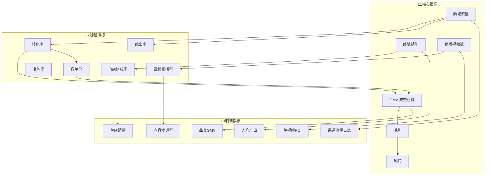

# 车企周边好物商城驾驶舱 — 指标词典

> 版本：v1.0 | 更新日期：2026-04-02 | 状态：正式版

---

## 目录

1. [L1 核心指标（老板看的）](#l1-核心指标老板看的)
2. [L2 过程指标（总监看的）](#l2-过程指标总监看的)
3. [L3 明细指标（经理看的）](#l3-明细指标经理看的)
4. [指标关系图](#指标关系图)
5. [数据来源说明](#数据来源说明)

---

## L1 核心指标（老板看的）

### 1.1 GMV（成交总额）

| 项目 | 内容 |
|------|------|
| **指标名称（中文）** | GMV / 成交总额 |
| **指标名称（英文）** | Gross Merchandise Volume |
| **简称** | GMV |
| **定义** | 统计周期内，商城所有已下单且支付成功的订单金额总和（含退款前的金额，即退款不从 GMV 中扣除） |
| **计算公式** | GMV = Σ（已支付订单金额） |
| **数据来源** | 订单系统（order_db.orders 表） |
| **更新频率** | 实时 / 日汇总 |
| **异常阈值** | 日环比下滑 > 20% 触发预警；周环比下滑 > 15% 触发告警 |
| **归因维度** | 品类、渠道（线上/线下/内容）、时间（日/周/月）、门店、会员层级 |
| **负责人角色** | CEO / 商城总负责人 |
| **备注** | 区分线上GMV和线下GMV；线下GMV由终端门店POS数据提供 |

---

### 1.2 毛利（Gross Profit）

| 项目 | 内容 |
|------|------|
| **指标名称（中文）** | 毛利 |
| **指标名称（英文）** | Gross Profit |
| **简称** | GP |
| **定义** | 统计周期内，GMV 扣除商品进货成本后的利润 |
| **计算公式** | 毛利 = GMV - 商品成本 = GMV × 毛利率 |
| **辅助指标** | 毛利率 = 毛利 / GMV × 100% |
| **数据来源** | 订单系统 + 财务系统（商品成本数据） |
| **更新频率** | 日汇总（月初确认成本后更新） |
| **异常阈值** | 毛利率月环比下滑 > 3 个百分点触发预警 |
| **归因维度** | 品类、渠道、供应商、促销活动 |
| **负责人角色** | CFO / 财务总监 |
| **备注** | 成本核算口径需与财务部门对齐，注意促销折扣对毛利率的影响 |

---

### 1.3 利润（Net Profit）

| 项目 | 内容 |
|------|------|
| **指标名称（中文）** | 利润 / 净利润 |
| **指标名称（英文）** | Net Profit |
| **简称** | NP |
| **定义** | 统计周期内，毛利扣除所有运营成本（人力、营销、物流、平台费等）后的最终盈利 |
| **计算公式** | 利润 = 毛利 - 运营成本 = GMV × 毛利率 - 运营成本 |
| **运营成本明细** | 人力成本 + 营销费用 + 物流费用 + 平台服务费 + 其他运营成本 |
| **数据来源** | 财务系统（月度结算数据） |
| **更新频率** | 月更（月末结算后 T+5 天） |
| **异常阈值** | 月利润率 < 5% 触发预警；出现亏损立即告警 |
| **归因维度** | 业务线、成本类型、时间 |
| **负责人角色** | CEO / CFO |
| **备注** | 与月报数据保持一致，月度更新时需与财务确认口径 |

---

### 1.4 终端销能（Terminal Sales Capability）

| 项目 | 内容 |
|------|------|
| **指标名称（中文）** | 终端销能 |
| **指标名称（英文）** | Terminal Sales Capability |
| **简称** | TSC |
| **定义** | 衡量线下终端门店（4S店/城市展厅/快闪店）综合销售能力的复合得分 |
| **计算公式** | 终端销能得分 = w₁×销额达标率 + w₂×人均产出 + w₃×新客转化率 + w₄×复购贡献 （w₁=0.4, w₂=0.3, w₃=0.2, w₄=0.1） |
| **数据来源** | POS 系统 + CRM 系统 + 门店管理系统 |
| **更新频率** | 周更（每周一更新上周数据） |
| **异常阈值** | 整体得分 < 60 分触发预警；单店连续 3 周不达标触发告警 |
| **归因维度** | 城市、门店类型（4S店/展厅/快闪店）、门店规模、店龄 |
| **负责人角色** | 渠道总监 / 线下运营负责人 |
| **备注** | 评分权重需每季度与业务方复核调整；4S店和展厅的达标标准不同 |

---

### 1.5 优质生态视频数量（Quality Eco-Video Count）

| 项目 | 内容 |
|------|------|
| **指标名称（中文）** | 优质生态视频数量 |
| **指标名称（英文）** | Quality Eco-Video Count |
| **简称** | QVC |
| **定义** | 统计周期内，在各内容平台（抖音/小红书/B站/视频号）发布的与商城商品相关、且符合"优质"标准的视频数量 |
| **优质视频标准** | 满足以下任一条件：① 播放量 ≥ 1万；② 点赞率 ≥ 5%；③ 带来 ≥ 5 单转化 |
| **计算公式** | 优质视频数 = Σ（符合优质标准的视频数量） |
| **数据来源** | 各平台开放API（抖音/小红书/B站/视频号） |
| **更新频率** | 日更（T+1，因平台数据延迟） |
| **异常阈值** | 周新增优质视频 < 10 条触发预警 |
| **归因维度** | 平台（抖音/小红书/B站/视频号）、创作者类型（KOL/KOC/官方）、品类、内容类型 |
| **负责人角色** | 内容运营总监 |
| **备注** | 各平台的数据获取存在 T+1 延迟，优质标准需定期复核；需关注视频带货转化率，而非仅追求数量 |

---

### 1.6 商城流量（Mall Traffic）

| 项目 | 内容 |
|------|------|
| **指标名称（中文）** | 商城流量 |
| **指标名称（英文）** | Mall Traffic |
| **简称** | MT |
| **定义** | 统计周期内，访问线上商城的独立用户数（UV，去重计算） |
| **计算公式** | 商城流量（UV）= 统计周期内访问商城的去重用户数 |
| **辅助指标** | PV（页面浏览量）、人均浏览页数（PV/UV）、平均停留时长 |
| **数据来源** | 埋点系统（神策/GrowingIO/自研） |
| **更新频率** | 实时 / 小时汇总 / 日汇总 |
| **异常阈值** | 日UV环比下滑 > 30% 触发预警；突发流量峰值 > 平均值3倍时预警（可能是爬虫） |
| **归因维度** | 渠道（自然/付费/内容/终端扫码/社交分享）、设备（iOS/Android/PC）、新老用户 |
| **负责人角色** | 增长负责人 / 流量运营总监 |
| **备注** | UV 以 Cookie + 登录用户 ID 双重去重；终端扫码进入需通过 UTM 参数区分 |

---

## L2 过程指标（总监看的）

### 2.1 转化率（Conversion Rate）

| 项目 | 内容 |
|------|------|
| **指标名称（中文）** | 转化率 |
| **指标名称（英文）** | Conversion Rate |
| **简称** | CVR |
| **定义** | 访问商城后最终下单支付的用户比例 |
| **计算公式** | 转化率 = 支付用户数 / 访客数（UV）× 100% |
| **细分公式** | 加购率 = 加购用户数 / UV；下单率 = 下单用户数 / UV；支付率 = 支付用户数 / 下单用户数 |
| **数据来源** | 订单系统 + 埋点系统 |
| **更新频率** | 日更 |
| **异常阈值** | 转化率日环比下滑 > 10% 触发预警 |
| **归因维度** | 渠道、品类、活动、页面、设备 |
| **负责人角色** | 电商运营总监 |

---

### 2.2 客单价（Average Order Value）

| 项目 | 内容 |
|------|------|
| **指标名称（中文）** | 客单价 |
| **指标名称（英文）** | Average Order Value |
| **简称** | AOV |
| **定义** | 平均每笔订单的成交金额 |
| **计算公式** | 客单价 = GMV / 支付订单数 |
| **数据来源** | 订单系统 |
| **更新频率** | 日更 |
| **异常阈值** | 客单价月环比变化 > ±15% 需分析原因 |
| **归因维度** | 品类、渠道、会员层级、促销活动 |
| **负责人角色** | 商品运营总监 |

---

### 2.3 复购率（Repurchase Rate）

| 项目 | 内容 |
|------|------|
| **指标名称（中文）** | 复购率 |
| **指标名称（英文）** | Repurchase Rate |
| **简称** | RR |
| **定义** | 统计周期内，有过 2 次及以上购买行为的用户占总购买用户的比例 |
| **计算公式** | 复购率 = 复购用户数（≥2次购买） / 总购买用户数 × 100% |
| **数据来源** | 订单系统 + CRM 系统 |
| **更新频率** | 周更 / 月更 |
| **异常阈值** | 月复购率 < 15% 触发预警 |
| **归因维度** | 品类、会员层级、首购渠道 |
| **负责人角色** | 用户运营总监 |

---

### 2.4 门店达标率（Store Target Achievement Rate）

| 项目 | 内容 |
|------|------|
| **指标名称（中文）** | 门店达标率 |
| **指标名称（英文）** | Store Target Achievement Rate |
| **简称** | STAR |
| **定义** | 统计周期内，完成月度销售目标的门店数量占总门店数量的比例 |
| **计算公式** | 门店达标率 = 达标门店数（实际销售≥目标销售×达标线%）/ 总门店数 × 100% |
| **达标线** | 默认 ≥ 80%（即完成目标 80% 即视为达标，可调整） |
| **数据来源** | POS 系统 + 门店目标管理系统 |
| **更新频率** | 周更 |
| **异常阈值** | 整体达标率 < 60% 触发预警 |
| **归因维度** | 城市、门店类型、区域 |
| **负责人角色** | 渠道总监 |

---

### 2.5 视频完播率（Video Completion Rate）

| 项目 | 内容 |
|------|------|
| **指标名称（中文）** | 视频完播率 |
| **指标名称（英文）** | Video Completion Rate |
| **简称** | VCR |
| **定义** | 完整观看视频（或观看 ≥ 80% 时长）的用户占开始播放视频的用户的比例 |
| **计算公式** | 视频完播率 = 完播用户数 / 播放用户数 × 100% |
| **数据来源** | 各平台开放 API |
| **更新频率** | 日更（T+1） |
| **异常阈值** | 完播率 < 20% 的视频标记为低质量，不计入优质视频 |
| **归因维度** | 平台、创作者、视频时长、内容类型 |
| **负责人角色** | 内容运营总监 |

---

### 2.6 跳出率（Bounce Rate）

| 项目 | 内容 |
|------|------|
| **指标名称（中文）** | 跳出率 |
| **指标名称（英文）** | Bounce Rate |
| **简称** | BR |
| **定义** | 只访问一个页面就离开商城的用户比例（未发生任何后续操作） |
| **计算公式** | 跳出率 = 只浏览一页的会话数 / 总会话数 × 100% |
| **数据来源** | 埋点系统 |
| **更新频率** | 日更 |
| **异常阈值** | 跳出率 > 70% 触发预警，需排查着陆页质量 |
| **归因维度** | 渠道、着陆页、设备、新老用户 |
| **负责人角色** | 增长负责人 |

---

## L3 明细指标（经理看的）

### 3.1 品类 GMV（Category GMV）

| 项目 | 内容 |
|------|------|
| **指标名称（中文）** | 品类 GMV |
| **指标名称（英文）** | Category GMV |
| **定义** | 按商品品类拆分的 GMV |
| **计算公式** | 品类 GMV = Σ（该品类已支付订单金额） |
| **数据来源** | 订单系统 + 商品系统 |
| **更新频率** | 日更 |
| **异常阈值** | 某品类 GMV 占比环比变化 > ±10% 需关注 |
| **归因维度** | 品类层级（一级/二级/三级品类）、渠道、时间 |
| **负责人角色** | 品类经理 |

---

### 3.2 单店销额（Per-Store Sales）

| 项目 | 内容 |
|------|------|
| **指标名称（中文）** | 单店销额 |
| **指标名称（英文）** | Per-Store Sales |
| **简称** | PSS |
| **定义** | 单个终端门店在统计周期内的销售总额 |
| **计算公式** | 单店销额 = Σ（该门店所有已支付订单金额） |
| **数据来源** | POS 系统 |
| **更新频率** | 日更 |
| **异常阈值** | 单店销额环比下滑 > 30% 且持续 2 周触发告警 |
| **归因维度** | 门店、城市、门店类型、时间 |
| **负责人角色** | 区域门店经理 |

---

### 3.3 单视频 ROI（Per-Video ROI）

| 项目 | 内容 |
|------|------|
| **指标名称（中文）** | 单视频 ROI |
| **指标名称（英文）** | Per-Video Return on Investment |
| **简称** | V-ROI |
| **定义** | 单个内容视频的投入产出比，衡量内容营销的效率 |
| **计算公式** | 单视频 ROI = 视频带来的 GMV / 视频制作+推广成本 |
| **数据来源** | 内容平台 API + 订单归因系统 + 成本系统 |
| **更新频率** | 周更 |
| **异常阈值** | ROI < 1 的视频为亏损；ROI > 10 为标杆视频需分析原因 |
| **归因维度** | 平台、创作者、品类、内容类型 |
| **负责人角色** | 内容运营经理 |
| **备注** | 视频归因使用最终触点归因（Last-Click），后续可升级为多触点归因 |

---

### 3.4 渠道流量占比（Channel Traffic Share）

| 项目 | 内容 |
|------|------|
| **指标名称（中文）** | 渠道流量占比 |
| **指标名称（英文）** | Channel Traffic Share |
| **简称** | CTS |
| **定义** | 各流量渠道的访客数占总访客数的比例 |
| **计算公式** | 渠道流量占比 = 该渠道 UV / 总 UV × 100% |
| **渠道分类** | 自然搜索 / 付费广告 / 抖音引流 / 小红书引流 / B站引流 / 终端扫码 / 社交分享 / 直接访问 |
| **数据来源** | 埋点系统（UTM 参数） |
| **更新频率** | 日更 |
| **异常阈值** | 单一渠道占比 > 60% 则流量过度集中，存在风险 |
| **归因维度** | 渠道、时间、新老用户 |
| **负责人角色** | 增长经理 |

---

### 3.5 人均产出（Revenue Per Staff）

| 项目 | 内容 |
|------|------|
| **指标名称（中文）** | 人均产出 |
| **指标名称（英文）** | Revenue Per Staff |
| **简称** | RPS |
| **定义** | 线下门店每位销售人员平均产生的销售额 |
| **计算公式** | 人均产出 = 门店销售额 / 销售人员数量 |
| **数据来源** | POS 系统 + HR 系统 |
| **更新频率** | 周更 |
| **异常阈值** | 人均产出低于行业基准 30% 触发预警 |
| **归因维度** | 门店、城市、岗位级别 |
| **负责人角色** | 区域门店经理 |

---

### 3.6 内容渗透率（Content Penetration Rate）

| 项目 | 内容 |
|------|------|
| **指标名称（中文）** | 内容渗透率 |
| **指标名称（英文）** | Content Penetration Rate |
| **简称** | CPR |
| **定义** | 通过内容（视频/图文）引导完成购买的订单占总订单的比例 |
| **计算公式** | 内容渗透率 = 内容归因订单数 / 总订单数 × 100% |
| **数据来源** | 订单归因系统 + 内容平台 API |
| **更新频率** | 周更 |
| **异常阈值** | 内容渗透率 < 10% 说明内容营销效果弱 |
| **归因维度** | 平台、品类、创作者类型 |
| **负责人角色** | 内容运营经理 |

---

### 3.7 库存周转率（Inventory Turnover Rate）

| 项目 | 内容 |
|------|------|
| **指标名称（中文）** | 库存周转率 |
| **指标名称（英文）** | Inventory Turnover Rate |
| **简称** | ITR |
| **定义** | 统计周期内，商品库存的周转速度 |
| **计算公式** | 库存周转率 = 销售成本 / 平均库存成本 |
| **辅助指标** | 库存周转天数 = 统计周期天数 / 库存周转率 |
| **数据来源** | 库存系统 + 财务系统 |
| **更新频率** | 周更 |
| **异常阈值** | 库存周转天数 > 90 天触发预警（积压风险） |
| **归因维度** | 品类、SKU、仓库 |
| **负责人角色** | 供应链经理 |

---

## 指标关系图

---

## 数据来源说明

| 数据来源 | 覆盖指标 | 更新机制 | 备注 |
|---------|---------|---------|------|
| **订单系统** | GMV、毛利、转化率、客单价、复购率、品类GMV | 实时写入，T+0 可查 | 核心数据源，需确认退款处理逻辑 |
| **财务系统** | 利润、毛利（成本口径）、库存周转率 | 月末结算，T+5 | 月度指标的权威来源 |
| **POS 系统** | 终端销能、单店销额、人均产出 | 日结，T+1 | 线下门店数据，需与门店系统打通 |
| **埋点系统** | 商城流量（UV/PV）、跳出率、渠道流量占比 | 实时采集，小时汇总 | 确认埋点规范，UTM 参数标准 |
| **抖音开放API** | 优质视频数、视频完播率、单视频ROI | T+1（平台延迟） | 需申请平台合作资质 |
| **小红书API** | 优质视频数（小红书）、内容渗透率 | T+1 | 数据获取限制较多，需评估 |
| **B站开放API** | 优质视频数（B站）、视频完播率 | T+1 | UP主合作内容 |
| **视频号** | 优质视频数（视频号）、视频完播率 | T+1 | 微信生态数据，需企业号权限 |
| **CRM 系统** | 复购率、会员层级分析 | 日更 | 用户行为分析的基础 |
| **门店管理系统** | 门店达标率、门店目标 | 周更（人工录入目标） | 目标录入需标准化流程 |

---

*文档维护：数据团队 | 更新周期：季度复核，指标口径变更时即时更新*
